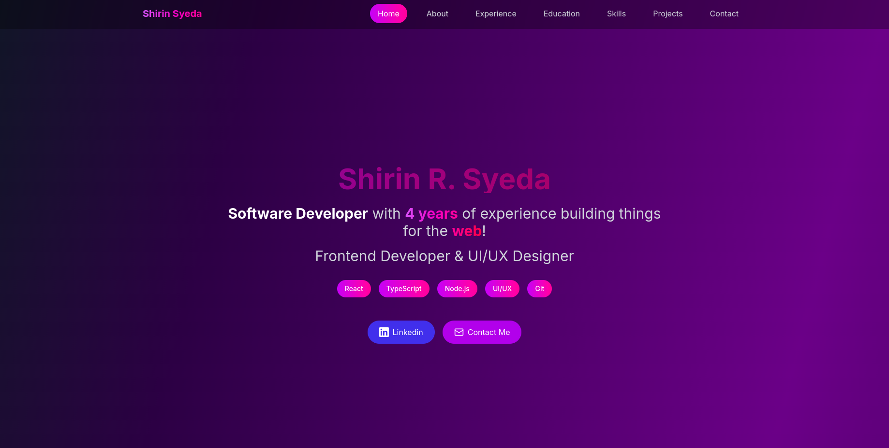

# Modern Portfolio Website

A sleek, responsive portfolio website built with React.js and Tailwind CSS, featuring smooth animations and an intuitive user interface.



## 🌟 Features

### 🎨 Modern Design
- Clean and minimalist interface
- Gradient color schemes
- Glass-morphism effects
- Responsive design for all devices
- Animated transitions and hover effects

### 📱 Navigation
- Fixed navigation bar with smooth scrolling
- Mobile-responsive hamburger menu
- Active section highlighting
- Seamless section transitions

### 🏠 Home Section
- Animated hero text with gradient effects
- Dynamic tag display
- Social media links
- Professional introduction
- Tech stack badges

### 💻 Technical Skills Section
- Interactive skill cards
- Animated progress bars
- Categorized skills display
- Hover animations
- Skill level visualization

### 💼 Experience Section
- Timeline of professional experience
- Detailed role descriptions
- Key achievements highlights
- Company information
- Interactive cards with hover effects

### 📞 Contact Section
- Direct email link
- LinkedIn profile connection
- Professional contact information
- Animated contact cards

### 🛠 Technical Features
- Smooth scroll implementation
- Intersection Observer for section detection
- Dynamic content rendering
- Optimized performance
- SEO friendly

## 🚀 Technologies Used

- React.js
- Tailwind CSS
- Lucide React Icons
- Shadcn UI Components
- CSS Animations
- React Hooks

## 📦 Installation

1. Clone the repository:
```bash
git clone https://github.com/ShirinSyeda98/Shirin-Portfolio.git
```

2. Install dependencies:
```bash
cd Shirin-Portfolio
npm install
```

3. Install required dependencies:
```bash
npm install -D tailwindcss postcss autoprefixer
npm install lucide-react @radix-ui/react-dialog
```

4. Initialize Tailwind CSS:
```bash
npx tailwindcss init -p
```

5. Start the development server:
```bash
npm start
```

## 🔧 Configuration

### Tailwind Configuration
```javascript
// tailwind.config.js
module.exports = {
  content: ["./src/**/*.{js,jsx,ts,tsx}"],
  theme: {
    extend: {
      // Custom configurations
    }
  },
  plugins: []
}
```

### Project Structure
```
shirin-portfolio/
├── src/
│   ├── components/
│   │   ├── ui/
│   │   │   └── card.jsx
│   │   └── Portfolio.js
│   ├── styles/
│   │   └── index.css
│   ├── App.js
│   └── index.js
├── public/
├── package.json
└── tailwind.config.js
```

## 🎨 Customization

### Updating Personal Information
- Edit the content in `Portfolio.js`
- Update social media links
- Modify skill sets and experience
- Add or remove sections as needed

### Styling
- Customize colors in Tailwind config
- Modify animations in CSS
- Adjust responsive breakpoints
- Update component styling

## 🌐 Deployment

The portfolio can be deployed using:
- GitHub Pages
- Vercel
- Netlify
- Heroku

Example deployment command for GitHub Pages:
```bash
npm run deploy
```

## 💡 Performance Optimization

- Lazy loading of images
- Optimized animations
- Minimized bundle size
- Efficient component rendering
- Smooth scrolling implementation

## 📱 Responsive Design

- Mobile-first approach
- Tablet optimization
- Desktop enhancement
- Cross-browser compatibility
- Touch-friendly interactions

## 🤝 Contributing

1. Fork the repository
2. Create your feature branch
3. Commit your changes
4. Push to the branch
5. Open a pull request

## 📄 License

This project is licensed under the MIT License - see the [LICENSE.md](LICENSE.md) file for details.

## 👤 Author

Shirin R. Syeda
- LinkedIn: [Shirin Syeda](https://www.linkedin.com/in/shirinsyeda/)
- Email: shirinsyeda98.work@gmail.com

## 🙏 Acknowledgments

- Design inspiration from modern web trends
- Tailwind CSS community
- React.js documentation
- Shadcn UI components